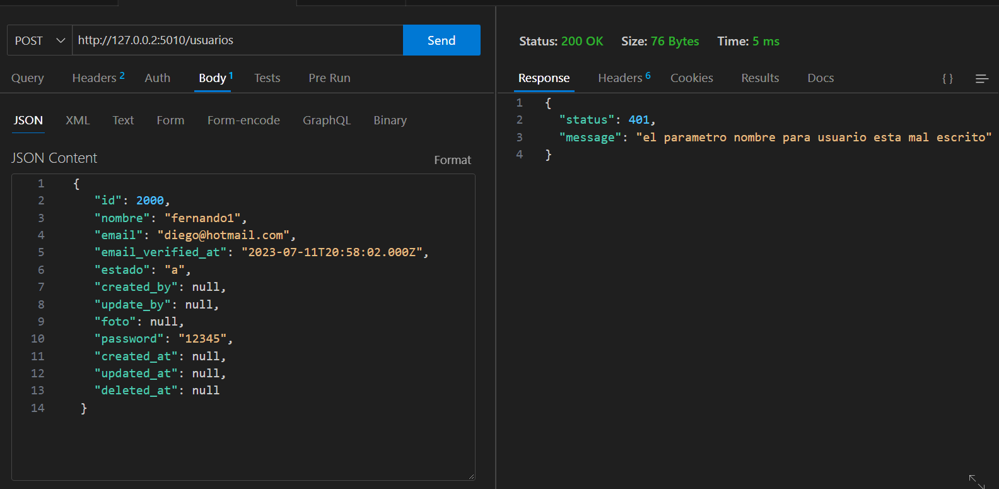
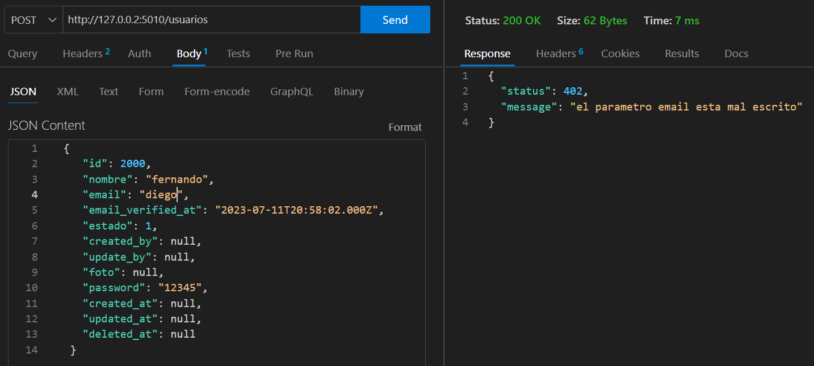
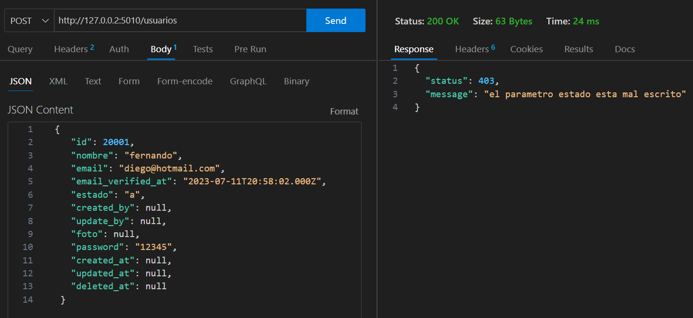

# Bodegas_Node_Express

Este proyecto es una aplicación Node.js la cual se conecta a una base de datos MySQL utilizando el paquete `mysql2`. El objetivo principal es gestionar las operaciones relacionadas con las tablas: bodegas, historiales, inventarios, productos y usuarios. A continuación, se detallan los pasos necesarios para configurar y utilizar el proyecto.

## Configuracion:

1-Clona este repositorio con el link = https://github.com/DiegoMartinez2094/db_prueba_backend_sql.git

2- Asegurate de tener instalado node: con el comando  npm install node en la terminal

3- Instala las dependencias del proyecto ejecutado el siguiente comando en la terminal del proyecto: npm install, esto instalará automaticamente las dependencias que tenemos previamente guardadas en el archivo package.json estas son :

* "dotenv": "^16.3.1",
* "express": "^4.18.2",
* "mysql2": "^3.5.1",
* "node": "^20.4.0",
* "nodemon": "^3.0.1"

4-Configura la conexión a la base de datos.  reemplaza los valores de `host`, `user`, `password` y `database `con los correspondientes, puedes descomentar los que están comentados si estás en campus.

5-Importa los datos de prueba a la base de datos. Ejecuta el script `db_prueba_backend_sql.sql` en tu cliente MySQL para crear las tablas y cargar los datos iniciales necesarios para realizar las pruebas.

Debe quedar así:

## USO:

1-Listar todas las bodegas ordenadas alfabéticamente:

* Método: GET
* Ruta: http://127.0.0.2:5010/bodegas

2-Crear una bodega:

* Método: POST
* Ruta:` http://127.0.0.2:5010/bodegas`
* Datos de entrada (en el cuerpo de la solicitud
  * nombre
  * id_responsable
  * estado
  * created_by
  * update_by
  * created_at
  * updated_at
  * deleted_at

3-Listar productos en orden descendente por cantidad:

* Método: GET
* Ruta:` http://127.0.0.2:5010/inventarios`

4-Insertar un producto

* Método: POST
* Ruta:` http://127.0.0.2:5010/productos`
* Datos de entrada (en el cuerpo de la solicitud):
  * nombre
  * descripcion
  * estado
  * created_by
  * update_by
  * created_at
  * updated_at
  * deleted_at

5-Insertar registros

* Método: POST
* Ruta:` http://127.0.0.2:5010/registros`

Datos de entrada (en el cuerpo de la solicitud):

* `idProducto`
* `idBodega`
* `cantidad`

## PRUEBAS DEL MIDDLEWARE:

En esta prueba observamos como al enviar un caracter numerico en el dato nombre, el middleware lo detecta y nos envia el error que creamos en este caso 404 ("el parametro nombre para usuario esta mal escrito")

En esta prueba enviamos el dato email erroneamente, podemos ver que nos detecta el error

Por último podemos ver que en el parametro estado que debería recibir un valor numerico, enviamos una letra lo que nos genera el error de la parte derecha.
